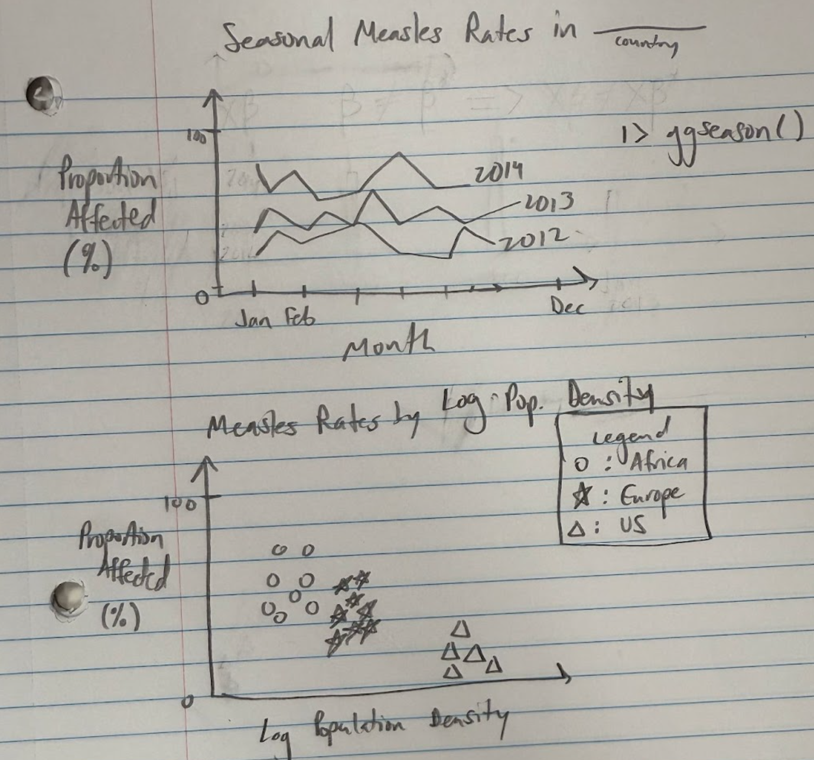

1.  **Describe the context of the data.**

[According to the WHO](https://www.who.int/news-room/fact-sheets/detail/measles), measles is a highly contagious disease spread by a virus which primarily affects young children. [Rubella](https://www.who.int/news-room/fact-sheets/detail/rubella) is a “less severe” variant of measles but will cause birth defects if contracted during pregnancy. Although vaccines are available, Measles-related deaths continue to occur, affecting mainly unvaccinated children. This data explores Measles and Rubella cases around the world and was downloaded from the [WHO Provisional monthly measles and rubella data](https://immunizationdata.who.int/global?topic=Provisional-measles-and-rubella-data&location=) on 2025-06-12. It contains geographical information such as region, country, iso3 (three letter country code) as well as time data such as year and month. There are multiple variables that describe Measles and Rubella cases, with each pertaining to a specific level of certainty of disease contraction or the type of symptoms a suspected individual is showing. Some of these variables are given below:

-   Measles_suspect: cases where the patient has a fever and maculopapular rash, or in whom a healthcare worker suspects measles
    -   Measles_clinical: suspected case has at least one of cough, coryza, or conjunctivitis
        -   No adequate clinical specimen was taken so it can’t be linked epidemiologically
    -   Measles_epi_linked: suspected case not confirmed by laboratory, but through time (rash onset occurring 7-23 days apart) and place (same area as confirmed case)
    -   Measles_lab_confirmed: suspected case confirmed positive by testing in a lab and vaccine-associated illness is ruled out
-   Measles_total: sum of clinically compatible, epidemiologically linked and laboratory confirmed cases

Lastly, there are some data regarding the population of countries and the rate of disease occurrence.

2.  **Explain what cleaning ha to be done to the data.**

We have to figure out how to handle the NA cases. Many of the entries have NA values for rubella cases across clinical, epi-linked and lab confirmed cases which impacts the total rubella cases. This may be due to which resources countries are limited to since rubella cases and measles cases are two individual tests. Additionally, some countries such as Chad, don’t have data for some months throughout the year.

3.  **Pose at least two research questions that could be addressed with these data.**

-   What country in Africa has the most measles cases (proportion), and how does this change over time?
    -   Is this geographically correlated (i.e. if a country has an extreme number of measles cases, do surrounding countries have a similar number of cases?
-   Does population density affect disease prevalence?
-   Are measles cases seasonal?

4.  **Pose at least two research questions that could be addressed using supplemental data.**

-   Does measles affect countries with different socioeconomic factors differently?
    -   How does measles impact richer countries compared to poorer countries?
-   What are the education levels within each country? How does that impact the number of measles and rubella cases?
-   How does a country’s age structure affect its disease prevalence

5.  **Sketch out two visualizations that could be made to address the research questions you posed above.**

